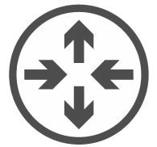
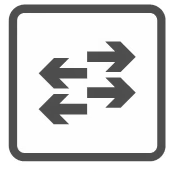
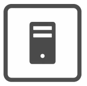
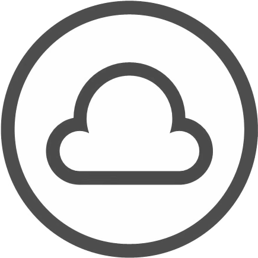

# 1 - Networking Devices

---

Wikipedia - 

> "A computer network is a <u>digital telecommunications</u> network which allows <u>nodes</u> to share <u>resources</u>."

Some examples of nodes:

| Router                                                                                                          | Switch                                                                                                          | Firewall                                                                                                          | Server                                                                                                          | Client                                                                                                          |
| --------------------------------------------------------------------------------------------------------------- | --------------------------------------------------------------------------------------------------------------- | ----------------------------------------------------------------------------------------------------------------- | --------------------------------------------------------------------------------------------------------------- | --------------------------------------------------------------------------------------------------------------- |
|  |  |  |  |  |

Servers and clients are *endpoints / end hosts.*

A client is a device that access a service made available by a server.

A server is a device that provides functions or services for clients.

A device can be both - it can be one in some situations and the other in other situations.

The internet is often represented by this symbol:

This symbol is also used to represent a part of a network where the details are not necessary.

*Switches* are used to connect devices and forward packets within a local area network. They cannot send data between different LANs - they do not connect to  the internet.

Some characteristics of switches are:

- They have many network interfaces for physical connections, often in the dozens.

- They provide connectivity to hosts within the same LAN.

- They do not provide connectivity between LANs.

A *router* is used to forward data between LANs - data is forwarded to the router (often via a switch), which then sends data to another router connected to a different LAN. The data can then be sent to the recipient device via a switch.

Some characteristics of routers are:

- Fewer network interfaces compared to switches.

- They are used to provide connectivity between LANs.

- Or, they are used to send data across the internet.

A *firewall* are specialty network security devices used to control what traffic enters and leaves the network. This control is implemented by setting rules within the firewall for what is and isn't allowed.

Some characteristics of firewalls are:

- They monitor and contol network traffic based on configured rules.

- They can be placed inside or outside the network.

- Next Generation Firwalls include modern and advanced filtering capabilities.

There are two types of firewalls: Network firewalls, and Host-based firewalls:

- Network firewalls are hardware devices that filter traffic between networks.

- Host-based firewalls are software applications that filter traffic entering and exiting a single host machine.
