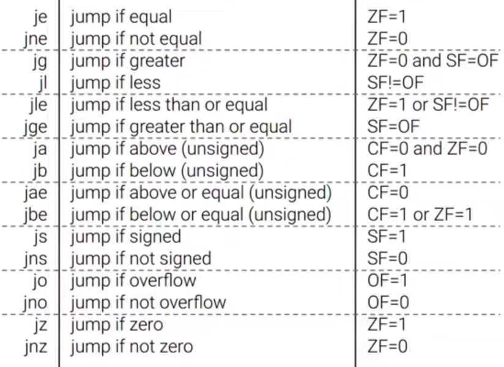

# Computing 101 - Control Flow

---

### Lecture 1 - Control Flow

+ x86_64 is a *variable width instruction set architecture* - instructions are not a set width, with some instructions only taking one byte to encode, some three bytes, etc

+ The binary code of a program being executed lives in memory in a sequential order

+ The CPU will continue to move through the program in order, step by step, unless it is told to move elsewhere via a control flow instruction

+ One example of such an instruction is `jmp`, which tells the CPU to skip a number of bytes in memory to 'jump' somewhere else in the set of instructions

+ `jmp` can move forwards or backwards depending on the byte/s it has as an argument: these bytes are signed, allowing for `jmp` to move the instruction pointer either forwards or backwards (the instruction is variable length to allow for different sized jumps)

+ `jmp -2` simply skips back to the start of the `jmp` instruction, creating an infinite loop: this instruction is `eb fe` in hex

+ `jmp` does not allow for decisions, it simply jumps somewhere else in the program, so if we want to only jump sometimes we need to use a *conditional jump*
  
  

+ Conditional jumps check a condition stored in the flag register: `rflag`

+ The bits in this register represent whether certain conditions have been met, which are updated after most arithmetic operations and comparison instructions such as `cmp` and `test`
  
  + `cmp` compares the actual values of registers, performing a subtraction but then discarding the result after updating flags
  
  + `cmp` subtracts the second value from the first value, so for `cmp rax, rbx` for example, conditional jumps would be considering `rax` in relation to `rbx`: if `rax` is less than `rbx`, if `rax` is above `rbx`, etc
  
  + `test` compares the actual bits of the registers, performing a bit-wise and operation but then discarding the result after updating flags

+ Some of the key flags are:
  
  + The carry flag - is the carry bit 1?
  
  + The zero flag - is the result 0?
  
  + The overflow flag - did the result wrap around between positive to negative?
  
  + The signed flag - did the result have a signed bit of 1 (so was it negative)?

+ Using conditional jumps, loops such as while and for statements can be implemented

+ To implement function calls, the instructions `call` and `ret` are used
  
  + `call` pushes the value of `rip` to stack and jumps to the location of the start of the function in memory
  
  + `ret` pops the previous value of `rip` from the stack and jumps there
- As all registers are shared across functions, with only a very limited number of registers, there is a set calling convention for x86-64 of which registers are used for what:
  
  - The registers `rdi`, `rsi`, `rdx`, `rcx`, `r8` and `r9` are used for arguments to the function or are otherwise up for grabs by the function
  
  - The return value of the function is saved in `rax`
  
  - Functions will not alter the values of `rbx`, `rbp`, `r12`, `r13`, `r14`, and `r15`, these are called "callee-saved" - if these values need to be changed during the function, they must be restored to their original value by the time the function returns
  
  - `r10` and `r11` have no specific purpose within a call but can be modified and used by the function without any requirement to preserve or restore their value
  
  - If any other values outside of the callee-saved registers needs to be preserved from before the function call, it should be pushed to the stack for recovery via pop afterwards, or saved to memory

---

### Notes from Challenges

- 
